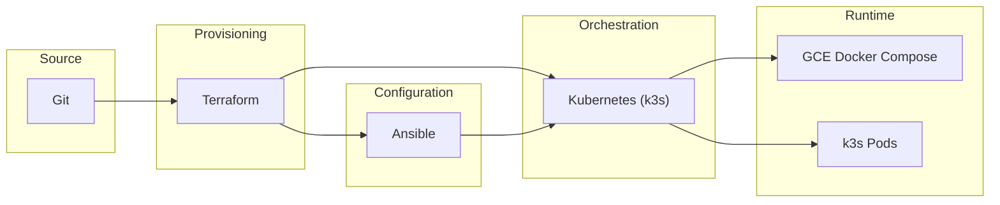
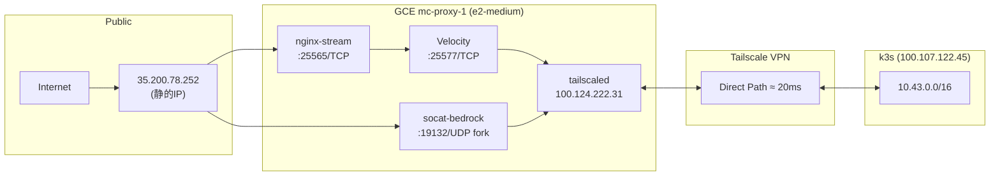
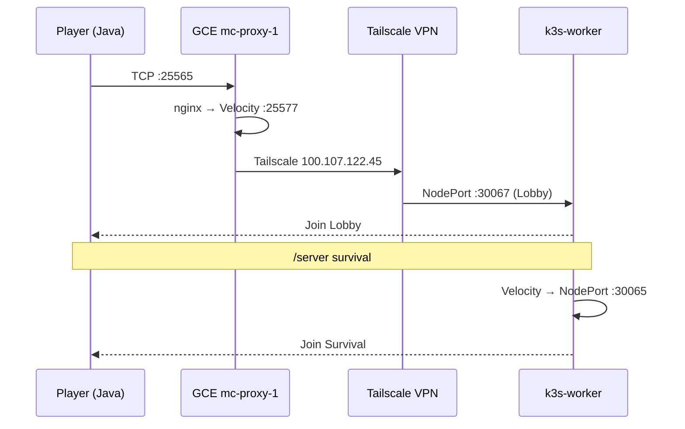
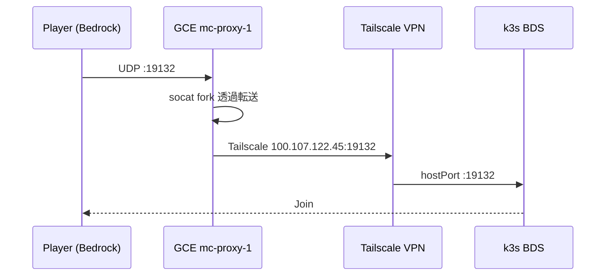
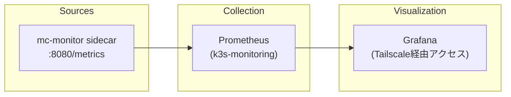

**Hybrid Cloud Minecraft Infrastructure**

Minecraftマルチサーバーを **GCE + オンプレミス k3s** のハイブリッド構成で運用するインフラ基盤です。
2026-05-03 に GKE → GCE 移行を完了し、月額 ¥19,700 → ¥3,680（81% 削減）を達成。

---

## 🎯 プロジェクト概要

| 観点 | アプローチ |
|------|-----------|
| **コスト最適化** | GKE 廃止 → GCE 単一 VM + Docker Compose（81% 削減達成） |
| **可用性** | プロキシ層をクラウドに配置、グローバルアクセス確保 |
| **運用効率** | Terraform / Ansible / Kubernetes による IaC |
| **セキュリティ** | Tailscale によるゼロトラストネットワーク |

---

## 🏗️ システムアーキテクチャ


### コンポーネント一覧

| レイヤー | コンポーネント | 配置 | 役割 |
|----------|---------------|------|------|
| Entry | nginx-stream | GCE Docker Compose | Java TCP 25565 → Velocity へ中継 |
| Entry | socat-bedrock | GCE Docker Compose | Bedrock UDP 19132 fork透過転送（RakNet対応） |
| Proxy | Velocity 3.4 | GCE Docker Compose | Java版プロキシ・サーバー振り分け |
| Game | Lobby (Paper) | On-Prem k3s | プレイヤー初回接続先（8Gi） |
| Game | Survival (Paper) | On-Prem k3s | バニラサバイバル（16Gi） |
| Game | Industry (NeoForge) | On-Prem k3s | 工業 MOD サーバー（30Gi） |
| Game | Bedrock BDS | On-Prem k3s | Bedrock Edition（8Gi / hostPort 19132） |
| Network | Tailscale | Both | ゼロトラストVPN（Direct ≈ 20ms） |
| Monitoring | Prometheus + Grafana | On-Prem k3s-monitoring | メトリクス収集・可視化 |

---

## 🔧 技術スタック

### Infrastructure as Code



| ツール | 用途 |
|--------|------|
| **Terraform** | GCE VM / VPC / Proxmox VM プロビジョニング |
| **Ansible** | k3s インストール、マニフェストデプロイ |
| **Kubernetes (k3s)** | オンプレ コンテナオーケストレーション |
| **Docker Compose** | GCE VM 上の Velocity / nginx / socat |
| **Tailscale** | メッシュVPN（WireGuard）|

---

## 🌐 ネットワーク構成



| 項目 | 値 |
|------|-----|
| GCE 静的IP | `35.200.78.252` |
| Tailscale GCE | `100.124.222.31` |
| Tailscale k3s-worker | `100.107.122.45` |
| k3s Service CIDR | `10.43.0.0/16` |

---

## 🎮 プレイヤー接続フロー





---

## 💰 コスト構成

| 項目 | 月額 |
|------|------|
| GCE e2-medium (asia-northeast1-b) | ¥3,500 |
| pd-balanced 20GB | ¥120 |
| 静的IP × 1（VM アタッチ中は無料） | ¥0 |
| Egress | ~¥50 |
| Secret Manager | ¥0〜10 |
| **GCP 合計** | **約 ¥3,680/month** |
| オンプレ電気代 | ~¥3,000/month |
| **総合計** | **約 ¥6,680/month** |

> 移行前（GKE Standard）: ¥19,700/month → **81% 削減達成**

---

## 📁 リポジトリ構成

```
.
├── gce/                          # GCE プロキシ VM 構成
│   ├── compose.yaml              # velocity + nginx-stream + socat-bedrock
│   ├── nginx/nginx.conf          # TCP 25565 stream proxy
│   ├── velocity/                 # velocity.toml, forwarding.secret.example
│   ├── systemd/                  # mc-proxy.service, fetch-secrets.sh
│   └── cloud-init.yaml           # VM 初期セットアップ
│
├── Terraform/                    # インフラプロビジョニング
│   ├── gce.tf                    # GCE VM, SA, Firewall, 静的IP
│   ├── gke.tf                    # VPC, Firewall（GKE リソースは削除済み）
│   ├── proxmox.tf                # Proxmox VM (k3s-worker, k3s-monitoring)
│   └── variables.tf / main.tf
│
├── Ansible/                      # k3s セットアップ
│   ├── install_k3s.yml
│   └── deploy_minecraft.yml
│
├── k8s/onprem/                   # オンプレ k3s マニフェスト
│   ├── backend-servers.yaml      # BDS Deployment + tailscale-subnet-router
│   ├── bds-backup-cronjob.yaml   # 日次バックアップ CronJob (MinIO)
│   ├── 30-prometheus-monitoring.yaml
│   └── helm/                     # Java サーバー Helm Chart
│       ├── minecraft-server/     # Chart テンプレート
│       ├── values-survival.yaml
│       ├── values-industry.yaml
│       └── values-lobby.yaml
│
└── Documents/                    # ドキュメント
    ├── README/                   # Wiki ホーム・ガイド
    ├── architecture/             # Mermaid ダイアグラム
    ├── OperationPostmortem/      # 障害振り返り
    └── Task_mds/                 # 作業手順書
```

---

## 🚀 クイックスタート

### 前提条件

- Terraform >= 1.5.0
- Ansible
- kubectl / k3s kubeconfig
- gcloud CLI（認証済み）
- Tailscale アカウント

### 1. GCE VM 構築

```bash
cd Terraform
cp secret.tfvars.template secret.tfvars
# secret.tfvars を編集（Proxmox 認証情報, SSH 公開鍵）

terraform init
terraform plan -var-file=secret.tfvars
terraform apply -var-file=secret.tfvars
```

VM 起動後、cloud-init が Docker / Tailscale / mc-proxy.service をプロビジョニング（約 3〜5 分）。

### 2. GCE 動作確認

```bash
# SSH（IAP 経由）
gcloud compute ssh mc-proxy-1 --zone=asia-northeast1-b --tunnel-through-iap

# VM 内
docker compose -f /opt/mc-proxy/compose.yaml ps
tailscale ping --until-direct 100.107.122.45

# 外部疎通テスト
nc -zv 35.200.78.252 25565      # Java TCP
nc -zuv 35.200.78.252 19132     # Bedrock UDP
```

### 3. オンプレミス k3s マニフェスト適用

```bash
# BDS / tailscale-router
kubectl --kubeconfig k8s/onprem/onprem_kubeconfig.yaml apply -f k8s/onprem/backend-servers.yaml

# Java サーバー（Helm）
helm --kubeconfig k8s/onprem/onprem_kubeconfig.yaml upgrade --install \
  mc-lobby k8s/onprem/helm/minecraft-server \
  -f k8s/onprem/helm/values-lobby.yaml -n minecraft

# 監視
kubectl --kubeconfig k8s/onprem/onprem_kubeconfig.yaml apply -f k8s/onprem/30-prometheus-monitoring.yaml
```

---

## 📊 監視体制



---

## 📚 ドキュメント

| ドキュメント | 説明 |
|-------------|------|
| [[neoforge-mod-guide]] | NeoForge サーバーへの MOD 追加ガイド |
| [[OperationPostmortem/Template]] | 障害振り返りテンプレート |
| [[Task_mds/restore-bedrock-world]] | BDS ワールドリストア手順 |
| [[Task_mds/fix-nasu-golem-vv]] | Nasu Golem VV 対応化手順 |

---

## 📝 ブランチ戦略

| ブランチ | 用途 |
|----------|------|
| `main` | 本番適用済み安定版 |
| `feature/*` | 機能追加 |
| `fix/*` | バグ修正 |

---

## 👤 Author

**HN:田籠 勇吉(Tagomori0211)**

- インフラエンジニア / SRE志望
- ハイブリッドクラウド・IaC実践ポートフォリオ

---

> **License**: MIT License
