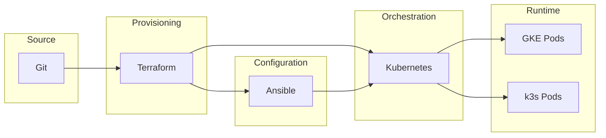
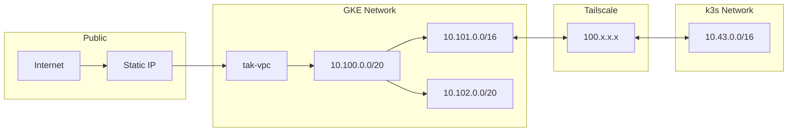
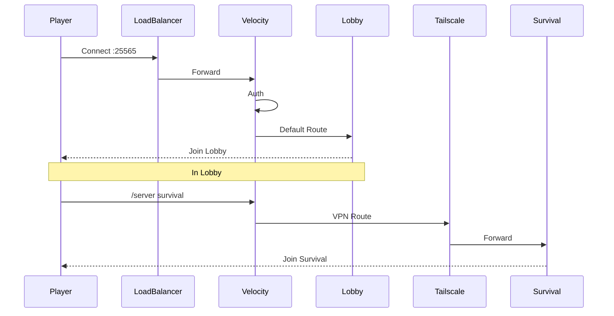
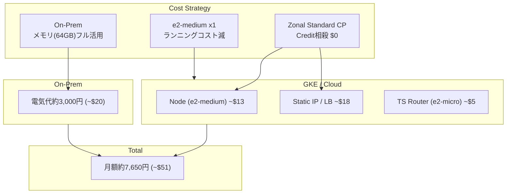
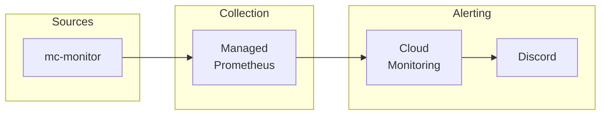
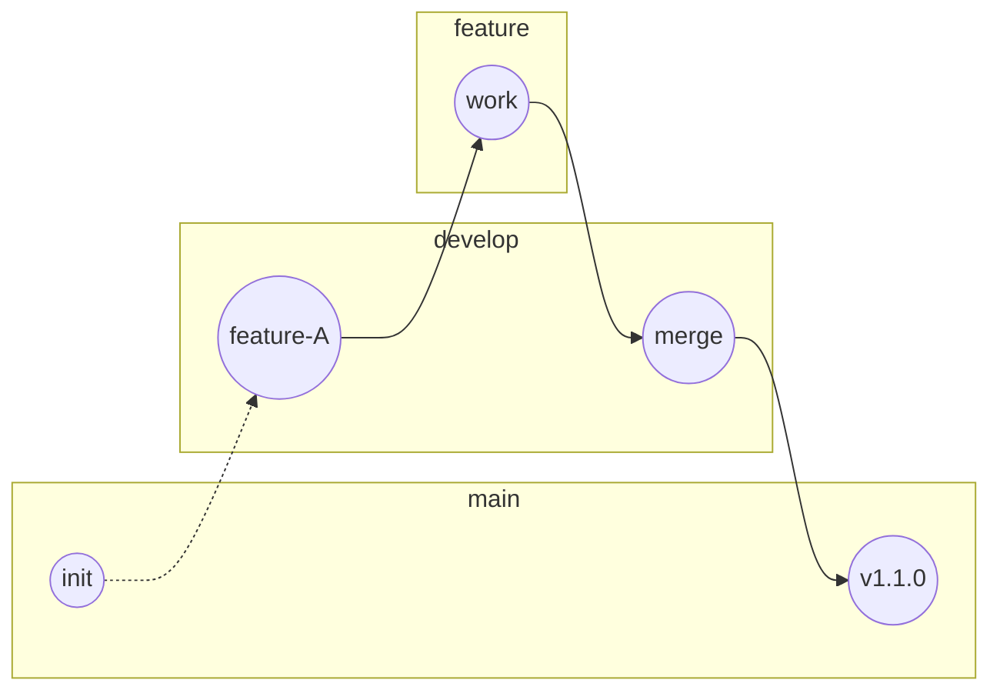

**Hybrid Cloud Minecraft Infrastructure**

Minecraftマルチサーバーを **GKE Standard + オンプレミス k3s** のハイブリッド構成で運用するインフラ基盤です。

---

## 🎯 プロジェクト概要

| 観点 | アプローチ |
|------|-----------|
| **コスト最適化** | GKE Spot Pod（最大91%削減）+ オンプレ大容量メモリ活用 |
| **可用性** | プロキシ層をクラウドに配置、グローバルアクセス確保 |
| **運用効率** | Terraform / Ansible / Kubernetes による IaC |
| **セキュリティ** | Tailscale によるゼロトラストネットワーク |

---

## 🏗️ システムアーキテクチャ


### コンポーネント一覧

| レイヤー | コンポーネント | 配置 | 役割 |
|----------|---------------|------|------|
| Entry | Velocity Proxy | GKE | プレイヤー接続受付、サーバー振り分け |
| Lobby | Paper Server | GKE | 軽量ロビー（Spot Pod） |
| Game | Survival Server | On-Prem | バニラサバイバル（4GB） |
| Game | Industry Server | On-Prem | NeoForge工業MOD（8GB） |
| Network | Tailscale | Both | ゼロトラストVPN |

---

## 🔧 技術スタック

### Infrastructure as Code



| ツール | 用途 |
|--------|------|
| **Terraform** | GKE / VPC / NAT / Proxmox VM プロビジョニング |
| **Ansible** | k3s インストール、マニフェストデプロイ |
| **Kubernetes** | コンテナオーケストレーション（k3s + GKE） |
| **Tailscale** | メッシュVPN（WireGuard） |

---

## 🌐 ネットワーク構成



| CIDR | 用途 |
|------|------|
| `10.100.0.0/20` | GKE Subnet |
| `10.101.0.0/16` | GKE Pod CIDR |
| `10.102.0.0/20` | GKE Service CIDR |
| `10.43.0.0/16` | k3s Service CIDR（Tailscale advertise） |

---

## 🎮 プレイヤー接続フロー



---

## 💰 コスト構成



---

## 📁 リポジトリ構成

```
.
├── README.md                 # プロジェクト概要
├── docs/                     # ドキュメント
│   ├── OVERVIEW.md          # コラボレーター向け概要
│   ├── OPERATIONS.md        # 運用監視フロー
│   ├── ARCHITECTURE.md      # アーキテクチャ詳細図
│   └── postmortems/         # 障害振り返り
│
├── Ansible/                  # 構成管理
│   ├── inventory.ini
│   ├── install_k3s.yml
│   └── deploy_minecraft.yml
│
├── Terraform/                # インフラプロビジョニング
│   ├── main.tf
│   ├── gke.tf
│   ├── proxmox.tf
│   └── variables.tf
│
└── k8s/                      # Kubernetesマニフェスト
    ├── gke/                  # GKE用
    └── onprem/               # k3s用
```

---

## 🚀 クイックスタート

### 前提条件

- Terraform >= 1.5.0
- Ansible
- kubectl
- gcloud CLI（認証済み）
- Tailscale アカウント

### 1. GKEクラスター構築

```bash
cd Terraform
cp secret.tfvars.template secret.tfvars
# secret.tfvars を編集

terraform init
terraform apply -var-file="secret.tfvars"
```

### 2. オンプレミス k3s セットアップ

```bash
cd Ansible
ansible-playbook -i inventory.ini install_k3s.yml
ansible-playbook -i inventory.ini deploy_minecraft.yml
```

### 3. GKE マニフェスト適用

```bash
gcloud container clusters get-credentials tak-entrance --region asia-northeast1

kubectl create secret generic velocity-secret \
  --from-literal=velocity-forwarding-secret='YOUR_SECRET' \
  -n minecraft

kubectl apply -f k8s/gke/
```

---

## 📊 監視体制



### 日常監視コマンド

```bash
# Pod状態確認
kubectl get pods -n minecraft

# Tailscale接続確認
kubectl exec deploy/velocity -n minecraft -c tailscale -- tailscale status

# リソース使用状況
kubectl top pods -n minecraft
```

---

## 📚 ドキュメント

| ドキュメント | 説明 |
|-------------|------|
| [[OVERVIEW.md]] | コラボレーター向け概要・開発環境セットアップ |
| [[OPERATIONS]] | 運用監視フロー・障害対応手順 |
| [[Operations/Postmortem Template]] | 障害振り返りテンプレート |

---

## 🔗 外部リンク

- [GKE Documentation](https://cloud.google.com/kubernetes-engine/docs)
- [k3s Documentation](https://docs.k3s.io/)
- [Tailscale Documentation](https://tailscale.com/kb/)
- [Velocity Documentation](https://docs.papermc.io/velocity)

---

## 📝 ブランチ戦略



| ブランチ | 用途 |
|----------|------|
| `main` | 本番適用済み安定版 |
| `develop` | 開発統合ブランチ |
| `feature/*` | 機能追加 |
| `fix/*` | バグ修正 |

---

## 👤 Author

**HN:田籠 勇吉(Tagomori0211)**

- インフラエンジニア / SRE志望
- ハイブリッドクラウド・IaC実践ポートフォリオ

---

> **License**: MIT License
