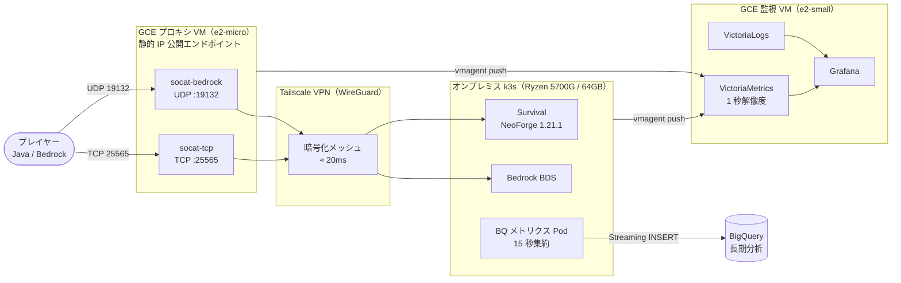

# Minecraft Hybrid Cloud Infrastructure

**GCE + オンプレミス k3s のハイブリッド構成で Minecraft を運用するインフラ基盤**

[](../../LICENSE)


---

## プロジェクト概要

Java 版・Bedrock 版に両対応した Minecraft サーバーを、**GCP（GCE）とオンプレミスのハイブリッド構成**で運用するインフラ基盤です。

クラウド側は **socat 透過転送のみ** に機能を絞り込んだ薄いプロキシ層（e2-micro）とし、メモリ集約型のゲームサーバーをオンプレミス k3s に寄せることでコストを最小化。監視・ログ基盤は独立した GCE VM（e2-small）上に構築し、クラスタ障害時も観測を継続できる設計としています。

インフラ全体を Terraform / Ansible / Kubernetes マニフェストで宣言的に管理し、メトリクス・ログ・アラート・バックアップ・課金通知まで IaC の範囲に含めています。

### 設計思想

| 観点 | アプローチ |
|------|-----------|
| **コスト最適化** | クラウド VM を最小スペックに絞り、重量級ワークロードをオンプレミスに集約 |
| **可用性** | クラウド側の静的 IP で世界中からのアクセスを保証 |
| **可観測性** | メトリクス（1 秒解像度）+ ログを Grafana に集約、長期分析は BigQuery |
| **セキュリティ** | Tailscale ゼロトラストネットワーク・公開ポートを最小化 |
| **運用効率** | Terraform / Ansible / k8s マニフェストで完全宣言的管理 |

---

## アーキテクチャ


```mermaid
flowchart LR
    Player(["プレイヤー\nJava / Bedrock"])

    subgraph GCE_Proxy["GCE プロキシ VM（e2-micro）\n静的 IP 公開エンドポイント"]
        socat_tcp["socat-tcp\nTCP :25565"]
        socat_bds["socat-bedrock\nUDP :19132"]
    end

    subgraph VPN["Tailscale VPN（WireGuard）"]
        mesh["暗号化メッシュ\n≈ 20ms"]
    end

    subgraph OnPrem["オンプレミス k3s（Ryzen 5700G / 64GB）"]
        survival["Survival\nNeoForge 1.21.1"]
        bedrock["Bedrock BDS"]
        bq_pod["BQ メトリクス Pod\n15 秒集約"]
    end

    subgraph GCE_Mon["GCE 監視 VM（e2-small）"]
        vm["VictoriaMetrics\n1 秒解像度"]
        grafana["Grafana"]
        vlog["VictoriaLogs"]
    end

    BQ[("BigQuery\n長期分析")]

    Player -->|TCP 25565| socat_tcp
    Player -->|UDP 19132| socat_bds
    socat_tcp --> mesh
    socat_bds --> mesh
    mesh --> survival
    mesh --> bedrock
    OnPrem -->|vmagent push| vm
    GCE_Proxy -->|vmagent push| vm
    bq_pod -->|Streaming INSERT| BQ
    vm --> grafana
    vlog --> grafana
```

### 接続フロー

```
Java:    プレイヤー → 静的IP:25565/TCP
              → socat-tcp → Tailscale → k3s NodePort
              → NeoForge Survival サーバー

Bedrock: プレイヤー → 静的IP:19132/UDP
              → socat-bedrock → Tailscale → k3s hostPort
              → Bedrock Dedicated Server
```

---

## 技術スタック

### Infrastructure as Code

| ツール | 用途 |
|--------|------|
| **Terraform** | GCE VM / MIG / VPC / IAM / BigQuery / Pub/Sub / Budget / Proxmox VM |
| **Ansible** | k3s + Tailscale インストール、マニフェストデプロイ |
| **Kubernetes (k3s)** | ゲームサーバー・バックアップ CronJob・監視エージェントのオーケストレーション |
| **Docker Compose** | GCE プロキシ VM・GCE 監視 VM のコンテナ管理 |

### クラウドサービス

| サービス | 構成 | 役割 |
|---------|------|------|
| **GCE プロキシ VM** | e2-micro / Autohealing MIG | socat による TCP/UDP 透過転送 |
| **GCE 監視 VM** | e2-small / Docker Compose | VictoriaMetrics + VictoriaLogs + Grafana |
| **BigQuery** | Streaming INSERT（15 秒集約） | メトリクス長期保存・コスト分析 |
| **Cloud Storage** | STANDARD / lifecycle 管理 | 月次ワールドバックアップ（遠隔保存） |
| **Pub/Sub + Budget** | Pull 型 Discord 通知 | 課金アラート（80% / 90% / 100%） |
| **Secret Manager** | - | Tailscale auth-key / Webhook URL 等 |
| **Tailscale** | メッシュ VPN | GCE ↔ オンプレのゼロトラスト接続 |

### アプリケーション

| コンポーネント | イメージ | 配置 |
|--------------|---------|------|
| socat-tcp / socat-bedrock | `alpine/socat` | GCE プロキシ VM |
| NeoForge Survival | `itzg/minecraft-server` | k3s |
| Bedrock Dedicated Server | `itzg/minecraft-bedrock-server` | k3s |
| VictoriaMetrics | `victoriametrics/victoria-metrics:v1.115.0` | GCE 監視 VM |
| VictoriaLogs | `victoriametrics/victoria-logs:v1.24.0-victorialogs` | GCE 監視 VM |
| Vector | `timberio/vector:0.56.0-debian` | GCE 監視 VM / k3s DaemonSet |
| vmagent | `victoriametrics/vmagent:v1.115.0` | GCE 監視 VM / k3s |
| vmalert + Alertmanager | `victoriametrics/vmalert` + `prom/alertmanager` | GCE 監視 VM |
| Grafana | `grafana/grafana:11.6.1` | GCE 監視 VM |

---

## 主要な設計ポイント

### 1. Bedrock UDP 透過転送（socat）

Bedrock の RakNet プロトコルは L7 プロキシ（Nginx Stream UDP / WaterdogPE 等）では
- パケットドロップによるインベントリ操作不能
- XUID 消失で多人数接続が不可（`Already connected` エラー）
- ソースポート書き換えによるセッション切断

などの障害が発生します（[ポストモーテム](../OperationPostmortem/)参照）。

`socat` の `fork` オプションでクライアントごとに独立した UDP ソケットを生成し、Tailscale 経由で BDS の `hostPort` まで **パケットを一切改変せず** 透過転送することで完全解決しました。Java 側も同様に `socat-tcp` で NodePort へ直結し、中間プロキシ層（Velocity / nginx-stream）を撤去しています。

### 2. ゲームサーバー構成

```
k3s minecraft namespace
  ├── deploy-survival    NeoForge 1.21.1（統合 MOD サーバー）
  │     ├── サイドカー: mc-monitor（メトリクスエクスポーター）
  │     └── サイドカー: log-shipper（ゲームログ → VictoriaLogs）
  └── deploy-bedrock     Bedrock Dedicated Server
        └── サイドカー: mc-monitor（カスタム MOTD ヘルスチェック）
```

ワールドは **同一サーバー上のカスタムディメンション** で分離（オーバーワールド＝生活 / `industry` ディメンション＝工業）。独立したサーバー間で振り分ける Lobby 層を廃し、運用負荷を削減しています。

### 3. 監視スタック（クラスタ外設計）

```
k3s vmagent（1 秒 scrape）────┐
                               ├─→ GCE 監視 VM VictoriaMetrics ──→ Grafana
GCE プロキシ vmagent（push）──┘

k3s Vector DaemonSet ─────────→ GCE 監視 VM VictoriaLogs ────→ Grafana
```

監視 VM を k3s クラスタから **完全に独立** させることで、クラスタ障害時も観測を継続できます。Grafana はファイアウォールで未公開とし、Tailscale ピアからのみアクセス可能です。

Bedrock の `MOTD 欠落` 障害（BDS バグで RakNet Pong に MOTD が含まれず 17 時間検知されなかった事例）を教訓に、カスタムエクスポーターが **MOTD の内容まで検証** して `healthy=1` を判定します。

### 4. メトリクス二段集積

```
VictoriaMetrics（1 秒解像度・14 日保持）
       │ PromQL query
       ▼
BQ 挿入 Pod（k3s）── 15 秒集約 ──→ BigQuery server_metrics
```

短時間スパイク（TPS・MSPT）は VM で高解像度観測し、長期トレンドは BigQuery に蓄積。課金 Export との JOIN で **プレイヤー比率によるコスト按分**（`cost_analysis_view`）も実現しています。

### 5. バックアップ戦略

```
日次 04:00 JST  CronJob ──→ オンプレ MinIO（S3 互換）    RPO: 24 時間
月次  1日 03:00 JST CronJob ──→ GCS STANDARD             RPO: 最大 30 日
                                  （31 日で ARCHIVE・365 日で削除）
```

GCS バックアップ完了時は **署名付き URL（7 日有効）付きの Discord 通知** を自動送信します。

---

## コスト削減の変遷

| フェーズ | 構成 | 月額 |
|---------|------|----:|
| GKE Hybrid（初期） | GKE Standard + オンプレ k3s | 約 ¥19,700 |
| **GCE 移行後（現行）** | **GCE 2台（e2-micro + e2-small）+ BQ + Pub/Sub** | **約 ¥7,000** |

主な削減要因：GKE 制御プレーン・Cloud NAT・Phantom LB の廃止、単一静的 IP への統合

### VPS との比較（参考）

同等メモリ（Java + Bedrock で 約 20〜24GB）を VPS で構築した場合との比較:

| 構成 | 月額 |
|------|----:|
| **現構成** | **約 ¥7,000** |
| 国内 VPS（24GB クラス） | ¥7,000〜¥26,000 |

VPS 単体と同価格帯で Terraform 管理・k3s・Tailscale・VictoriaMetrics・BigQuery・Discord 通知一式を実現しています。

---

## 実証された成果

| 指標 | 値 |
|------|-----|
| **月間クラウド支出** | 約 ¥7,000（GCE 2台 + BQ + Pub/Sub） |
| **コスト削減率** | GKE 構成比 **64% 削減**（¥19,700 → ¥7,000） |
| **遅延** | Tailscale Direct ≈ 20ms（東京リージョン経由） |
| **メトリクス解像度** | VM 上 1 秒 / BigQuery 15 秒集約 |
| **障害検知** | オンプレ沈黙・MOTD 欠落・鍵期限切れを自動アラート |
| **Terraform apply 時間** | VM プロビジョニング + cloud-init 約 5 分 |

---

## ロードマップ

### 完了済み

- GKE → GCE 移行・LB 統合・NAT 廃止
- Velocity / nginx-stream 廃止（socat 直結に統一）
- VictoriaMetrics + VictoriaLogs 監視スタックを GCE 専用 VM へ移行
- BigQuery `cost_analysis_view`（課金 Export × server_metrics 日次 JOIN）
- GCS バックアップ（月次 / lifecycle 管理）
- 課金アラート Discord 通知（Pub/Sub pull）
- vmalert + Alertmanager によるメトリクスアラート統一
- GCE プロキシを Autohealing MIG 化
- VictoriaLogs + Vector ログパイプライン

### 今後

- Looker Studio 公開ダッシュボード（`cost_analysis_view` 可視化）
- External Secrets Operator（k3s Secret 管理の外部化）
- Status Platform: Kotlin API + Flutter Web + Cloudflare Tunnel
- Argo CD 導入（k8s マニフェストの GitOps 化）
- バックアップ・リストア Runbook 整備

---

## ドキュメント

| ドキュメント | 内容 |
|-------------|------|
| [OVERVIEW.md](OVERVIEW.md) | コンポーネント詳細・運用ルール・ディレクトリ構成 |
| [ADRs.md](ADRs.md) | アーキテクチャ決定記録（技術選定の背景と根拠） |
| [OperationPostmortem/](../OperationPostmortem/) | 障害ポストモーテム |

---

## Author

**田籠 勇吉 (Tagomori Yukichi)**

- GitHub: [@Tagomori0211](https://github.com/Tagomori0211)
- インフラエンジニア / SRE 志望
- ハイブリッドクラウド・IaC 実践ポートフォリオ

---

> MIT License
