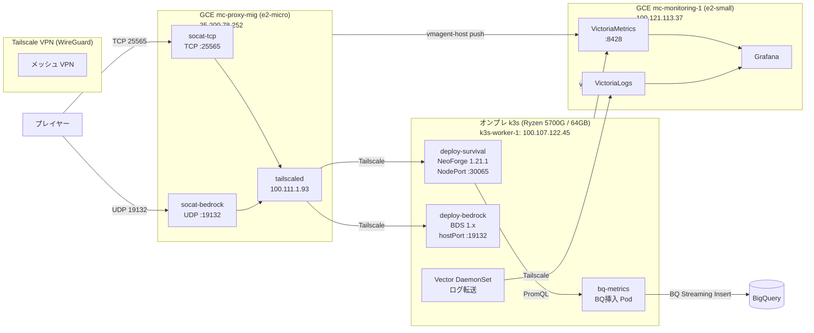

# Minecraft Hybrid Cloud Infrastructure — Overview

本ドキュメントは `Minecraft-on-Kubernetes` リポジトリの現行構成説明です。

---

## 目次

1. [プロジェクト概要](#プロジェクト概要)
2. [アーキテクチャ概要](#アーキテクチャ概要)
3. [コンポーネント詳細](#コンポーネント詳細)
4. [ネットワーク構成](#ネットワーク構成)
5. [監視・ログ基盤](#監視ログ基盤)
6. [バックアップ戦略](#バックアップ戦略)
7. [ディレクトリ構成](#ディレクトリ構成)
8. [運用ルール](#運用ルール)
9. [ブランチ戦略・コミット規約](#ブランチ戦略コミット規約)

---

## プロジェクト概要

### 何を作っているのか

**TAK Pipeline** は、Minecraft (Java版 / Bedrock版) のマルチサーバーを **ハイブリッドクラウド構成** で自宅運用するためのインフラ基盤です。

```
プレイヤー → GCE (socat 透過転送) → Tailscale VPN → オンプレミス k3s (ゲームサーバー)
```

### 技術スタックの概要

| レイヤー | 技術 | 役割 |
|---------|------|------|
| クラウド入口 | GCE e2-micro + Docker Compose | socat で TCP/UDP を透過転送 |
| VPN | Tailscale (WireGuard) | GCE ↔ オンプレのゼロトラスト接続 |
| ゲームバックエンド | k3s (オンプレ Proxmox VM) | Java / Bedrock サーバーのコンテナ管理 |
| 監視 | GCE e2-small + Docker Compose | VictoriaMetrics + Grafana |
| 長期分析 | BigQuery | 15 秒集約メトリクスの永続保存 |
| IaC | Terraform + Ansible | GCP・Proxmox リソースの宣言的管理 |

---

## アーキテクチャ概要



### 接続フロー

```
Java:    Player → 35.200.78.252:25565/TCP
              → socat-tcp (Docker Compose)
              → Tailscale (100.107.122.45)
              → svc-survival NodePort :30065
              → deploy-survival Pod

Bedrock: Player → 35.200.78.252:19132/UDP
              → socat-bedrock (Docker Compose)
              → Tailscale (100.107.122.45)
              → deploy-bedrock hostPort :19132
```

---

## コンポーネント詳細

### 1. GCE プロキシ層 — `mc-proxy-mig`

| 項目 | 値 |
|------|-----|
| 種別 | Autohealing MIG (Zonal, size=1) |
| マシン | e2-micro / 2GB RAM / pd-balanced 10GB |
| リージョン | asia-northeast1-b (東京) |
| 静的 IP | 35.200.78.252 |
| SSH アクセス | IAP 経由（インスタンス名は MIG 再作成で変動するため動的取得） |

**Docker Compose サービス (`gce/compose.yaml`):**

| コンテナ | 役割 |
|---------|------|
| `socat-tcp` | Java TCP :25565 → Tailscale → k3s :30065 |
| `socat-bedrock` | Bedrock UDP :19132 → Tailscale → k3s :19132 |
| `node-exporter` | VM ホストメトリクス収集 |
| `vmagent-host` | node-exporter を scrape し VictoriaMetrics へ push |

tailscaled はホスト systemd (kernel mode) で動作。コンテナからはホストの Tailscale ネットワークをそのまま使用。

### 2. オンプレ k3s バックエンド

| 項目 | 値 |
|------|-----|
| 仮想化基盤 | Proxmox VE (`mc-server`: 192.168.0.30) |
| VM スペック | Ryzen 5700G / 64GB RAM (vmid=105) |
| Tailscale IP | 100.107.122.45 (`k3s-worker-1`) |
| Namespace | `minecraft` |

**ゲームサーバー Pod (`k8s/onprem/backend-servers.yaml` + Helm):**

| Deployment | エンジン | メモリ | 公開方式 | コンテナ |
|-----------|---------|-------|---------|---------|
| `deploy-survival` | NeoForge 1.21.1 (MOD 統合サーバー) | 16Gi | NodePort :30065 | minecraft / mc-monitor / log-shipper |
| `deploy-bedrock` | BDS 1.x (Bedrock Edition) | 8Gi | hostPort :19132 | bedrock / mc-monitor |

> **Survival ワールド構成:** オーバーワールド（生活サバイバル）+ カスタムディメンション `industry`（工業 Tick 隔離）。Lobby / Industry の独立サーバーは廃止済み（ADR 05 参照）。

**その他 k8s リソース:**

| リソース | 種別 | 役割 |
|---------|------|------|
| `mc-log-shipper` | Deployment | ゲームログを VictoriaLogs へ転送 |
| `vector-daemonset` | DaemonSet | k3s ノードのシステムログ収集 |
| `bq-metrics` | Deployment | VictoriaMetrics から 15 秒集約 → BigQuery 挿入 |
| `bedrock-backup` | CronJob | 毎日 04:00 JST → MinIO (S3) |
| `gcs-backup` | CronJob | 毎月 → GCS（遠隔バックアップ） |

### 3. GCE 監視層 — `mc-monitoring-1`

| 項目 | 値 |
|------|-----|
| マシン | e2-small / 2GB RAM |
| Tailscale IP | 100.121.113.37 (`gce-mc-monitoring`) |
| 構成 | Docker Compose (`gce/monitoring/compose.yaml`) |

**Docker Compose サービス:**

| コンテナ | 役割 |
|---------|------|
| `victoria-metrics` | メトリクス TSDB (:8428)、保持期間 14 日 |
| `victoria-logs` | ログ TSDB |
| `vmagent` | k3s vmagent からの受信・ルーティング |
| `vector` | ログ受信・加工 |
| `grafana` | ダッシュボード |
| `alertmanager` | アラート通知 |
| `vmalert` | アラートルール評価 |

k3s クラスタから独立した第三者的な観測者として設計。クラスタ障害時も監視継続可能。

---

## ネットワーク構成

### Tailscale ノード一覧

| Tailscale IP | ホスト名 | 役割 |
|-------------|---------|------|
| 100.111.1.93 | `gce-mc-proxy` | GCE プロキシ VM (MIG) |
| 100.121.113.37 | `gce-mc-monitoring` | GCE 監視 VM |
| 100.107.122.45 | `k3s-worker-1` | オンプレ k3s ワーカー |
| 100.102.92.22 | `mc-server` | Proxmox ホスト |
| 100.113.254.77 | `code-server-vm` | 開発端末 |

> GCE インスタンス名は MIG autohealing により動的に変わる（例: `mc-proxy-p90c`）。SSH 前に `gcloud compute instances list` で現行名を取得すること。

### ポートマッピング

| プロトコル | 外部ポート | 転送先 |
|----------|-----------|--------|
| TCP | 25565 | k3s-worker-1:30065 (Java/NeoForge) |
| UDP | 19132 | k3s-worker-1:19132 (Bedrock BDS) |

---

## 監視・ログ基盤

### メトリクス収集

```
GCE proxy VM (node-exporter)
  └─ vmagent-host push ──────────────→ VictoriaMetrics (:8428)
                                              ↑
k3s (mc-monitor サイドカー :8080)             │
  └─ vmagent DaemonSet push ─────────────────┘
```

- Java/Bedrock サーバーの TPS・MSPT・プレイヤー数は **1 秒** 間隔でスクレイプ
- ノードメトリクス等は 15〜30 秒間隔（監視負荷抑制）

### 長期保存 — BigQuery

- k3s の `bq-metrics` Pod が VictoriaMetrics へ PromQL → **15 秒集約値を BQ へ Streaming Insert**
- VM の保持期間（14 日）を超えた長期分析・Looker Studio 可視化に利用
- プロジェクト規模では BQ 無料枠内で運用

### ログ収集

```
Minecraft Pod (log-shipper サイドカー)
  └─ Tailscale → VictoriaLogs

k3s ノード (Vector DaemonSet)
  └─ Tailscale → VictoriaLogs
```

---

## バックアップ戦略

| 種別 | 頻度 | 保存先 | RPO |
|------|-----|--------|-----|
| Survival ワールド | 日次 04:00 JST | オンプレ MinIO (S3) | 24 時間 |
| Bedrock ワールド | 日次 04:00 JST | オンプレ MinIO (S3) | 24 時間 |
| 遠隔バックアップ | 月次 | GCS (asia-northeast1) | 最大 30 日 |

- **RTO 目安:** 手動リストアで 15〜30 分
- リストア手順は `Documents/OperationPostmortem/` 参照

---

## ディレクトリ構成

```
.
├── .clinerules/              # エージェント共通ルール・DeepSeek ガードレール
├── .agents/
│   ├── rules/                # CLI 安全・k8s 命名規約等の細則
│   └── workflows/            # 手順書（SSH 操作・バックアップ等）
│
├── Terraform/                # GCP・Proxmox リソースの IaC
│   ├── gce.tf                # GCE MIG プロキシ VM
│   ├── monitoring.tf         # GCE 監視 VM
│   ├── proxmox.tf            # Proxmox k3s-worker VM
│   ├── gcs_backup.tf         # GCS バックアップバケット
│   └── billing.tf            # 予算アラート
│
├── k8s/onprem/               # k3s クラスタ用マニフェスト
│   ├── backend-servers.yaml  # Namespace + Bedrock Deployment
│   ├── helm/                 # Survival サーバー Helm values
│   ├── bds-backup-cronjob.yaml
│   ├── 35-gcs-backup-cronjob.yaml
│   ├── 40-bq-metrics.yaml    # BigQuery メトリクス挿入 Pod
│   ├── 40-mc-log-shipper.yaml
│   └── 42-vector-daemonset.yaml
│
├── gce/
│   ├── compose.yaml          # プロキシ VM の Docker Compose
│   ├── cloud-init.yaml       # プロキシ VM 初期化スクリプト
│   ├── monitoring/           # 監視 VM の Docker Compose + 設定
│   └── monitoring-cloud-init.yaml
│
├── Ansible/                  # k3s セットアップ・デプロイ自動化
├── Grafana/                  # ダッシュボード JSON
├── mods/velocity-portals/    # カスタム NeoForge MOD
├── ModList/                  # MODパック生成スクリプト
└── Documents/
    ├── README/               # ADRs.md・OVERVIEW.md（このファイル）
    ├── Mermaids/             # アーキテクチャ図
    └── OperationPostmortem/  # 障害ポストモーテム
```

---

## 運用ルール

### Pod 再起動（必須手順）

`minecraft` namespace の全 Deployment は `rollout restart` **禁止**。  
旧 Pod との並走によるメモリオーバーコミット → OOMKiller 発動を防ぐため、必ず以下の手順を取る。

```bash
ssh k3s-worker 'sudo kubectl scale deployment <name> -n minecraft --replicas=0'
# Terminating が消えるまで待機
ssh k3s-worker 'sudo kubectl scale deployment <name> -n minecraft --replicas=1'
```

詳細: ADR 03 / `.clinerules/00-common.md`

### kubectl / helm の実行制限

ローカルからの直接実行は **禁止**。必ず `ssh k3s-worker` 経由で実行する。

```bash
# 正しい例
ssh k3s-worker 'sudo kubectl get pods -n minecraft'

# 禁止例
kubectl get pods -n minecraft  # ← ローカルの kubeconfig は未設定
```

### Terraform

```bash
cd Terraform
terraform plan -var-file=secret.tfvars   # 必ず plan を確認してから
terraform apply -var-file=secret.tfvars
```

### GCE SSH（IAP 経由）

```bash
# 現行インスタンス名を取得してから接続
ssh k3s-worker 'gcloud compute instances list --filter="name~mc-proxy"'
# 例: mc-proxy-p90c
ssh k3s-worker 'gcloud compute ssh mc-proxy-p90c --zone=asia-northeast1-b --tunnel-through-iap'
```

---

## ブランチ戦略・コミット規約

### ブランチ運用

| ブランチ | 用途 |
|---------|------|
| `main` | 本番環境適用済み（直接 push 禁止） |
| `feature/*` | 機能追加 |
| `fix/*` | バグ修正 |
| `docs/*` | ドキュメント更新 |

### コミットメッセージ

```
<type>(<scope>): <subject>
```

| type | 用途 |
|------|------|
| `feat` | 新機能 |
| `fix` | バグ修正 |
| `docs` | ドキュメント |
| `refactor` | リファクタリング |
| `chore` | 依存更新・雑務 |

**scope 例:** `gce`, `k8s`, `terraform`, `monitoring`, `backup`, `bedrock`, `clinerules`
