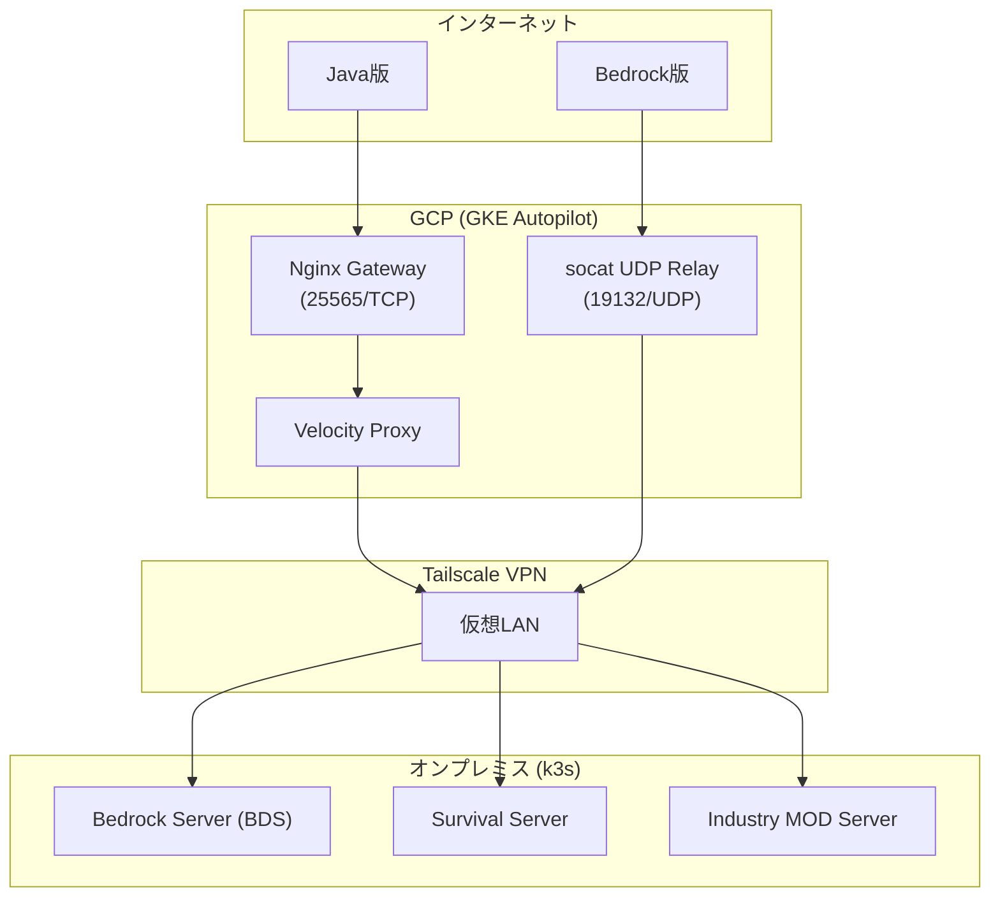

# 🟢 Minecraft Pipeline - Hybrid Cloud Edition

[](https://cloud.google.com/)
[](https://k3s.io/)
[](https://tailscale.com/)
[](LICENSE)

GKE Autopilot (GCP) とオンプレミス (k3s) を **Tailscale** でシームレスに結合した、ハイブリッドクラウド型 Minecraft サーバーインフラ。
Infrastructure as Code (IaC) を全面採用し、コスト最適化と高可用性を両立しています。

---

## 🏗️ サービス・アーキテクチャ

GKE を入口（エッジプロキシ）とし、メインのゲームインスタンスはリソース豊富なオンプレミス環境で動作させる構成です。



> [!TIP]
> **詳細な構成図は [Documents/architecture/infrastructure.mermaid](Documents/architecture/infrastructure.mermaid) を参照してください。**

---

## 💎 主要な設計思想

### 1. 超高効率なコスト戦略
- **GKE Spot Pod**: 全てのプロキシ/フロントエンドを Spot 実行し、コストを最大 91% 削減。
- **オンプレミス活用**: メモリ消費の激しい Java 版サーバーを自宅の Ryzen マシンで稼働させることで、クラウドの課金を最小限に抑制。

### 2. 透過的なネットワーク通信
- **Tailscale Sidecar Pattern**: GKE Pod 内に Tailscale コンテナを配置し、セキュアな P2P 通信を実現。
- **socat UDP Relay**: Bedrock 版 (RakNet) のセッション維持のため、Nginx Stream を回避し `socat` による透過的なパケット転送を採用。

### 3. 可観測性 (Monitoring)
- **Prometheus & Grafana**: 全環境のメトリクスを GKE 上で集約監視。
- **XUID 追跡**: Bedrock 版プレイヤーの Xbox ID を GKE ゲートウェイ経由でも正しく保持・記録。

---

## 📂 ディレクトリ構成

```text
.
├── Ansible/          # k3sノードの自動構築、マニフェストデプロイ
├── Terraform/        # GCP基盤、VPC、GKE、FirewallのIaC管理
├── k8s/              # Kubernetesマニフェスト
│   ├── gke/          # Gateway, Velocity, Monitoring
│   └── onprem/       # ゲームサーバー、Storage、StatusPlatform
├── Documents/        # 構成図、運用記録、ポストモーテム
├── .agents/          # AIエージェント用ワークフロー定義
└── scripts/          # データ修正・バックアップ用ユーティリティ
```

---

## 🛠️ 運用自動化 (Workflows)

`MCBDS_restore` 等のカスタムワークフローを整備し、AIエージェントによる迅速な復旧を可能にしています。

- **ワールド復旧**: `.mcworld` バックアップからの自動リストア。
- **構成更新**: `socat` リレーへの移行や VV 対応化のパッチ適用。

---

## 🚀 セットアップ・メンテナンス

### 基本コマンド
```bash
# GKE への接続情報取得
gcloud container clusters get-credentials tagomori-minecraft --region asia-northeast1

# ログ確認 (Bedrock)
kubectl --kubeconfig=k8s/onprem/onprem_kubeconfig.yaml logs deploy/deploy-bedrock -n minecraft

# ログ確認 (Gateway)
kubectl logs -l app=nginx-gw -n minecraft
```

### 命名規則 (sushiski cluster convention)
- **ConfigMap**: `<service>-<内容>-cm`
- **Deployment**: `<service>-<role>`
- **Labels**: `app.kubernetes.io/name`, `env: prod`, `managed-by: kubectl` 等を必須付与。

---

## 👤 Author

**田籠 勇吉 (Tagomori Yukichi)**
GitHub: [@tagomori0211](https://github.com/tagomori0211)

---

> [!IMPORTANT]
> 本プロジェクトは、クラウド・オンプレハイブリッド、Tailscale、IaC の実用的なポートフォリオとして継続的にメンテナンスされています。
