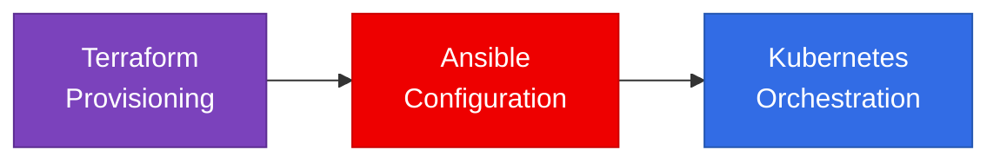
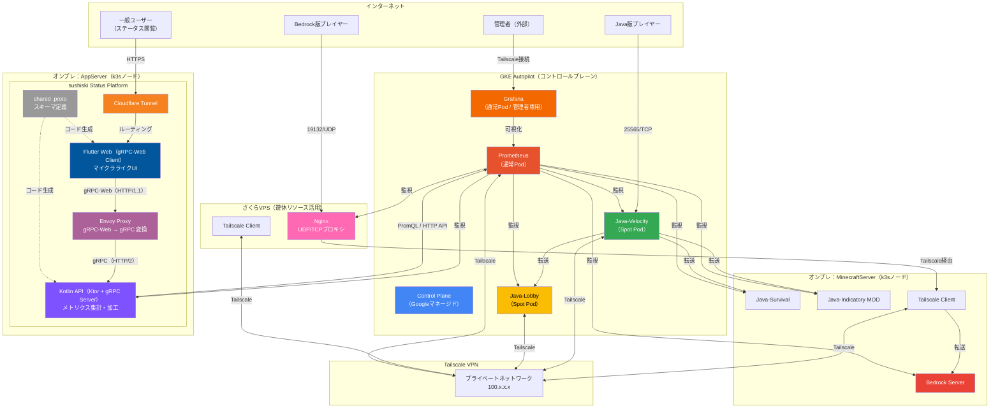

# TAK Pipeline - Hybrid Cloud Minecraft Infrastructure

**ハイブリッドクラウド構成によるMinecraftサーバー基盤**

[](LICENSE)


---

## 📋 プロジェクト概要

本プロジェクトは、**オンプレミス（自宅サーバー）とGoogle Cloud（GKE）を Tailscale VPN で接続**し、コスト効率と可用性を両立させたMinecraftサーバー基盤です。

Java版・Bedrock版の両対応、専用ステータスプラットフォーム（sushiski Status Platform）を含む総合的なゲームインフラを構成しています。

Infrastructure as Code（IaC）を全面採用し、**Terraform / Ansible / Kubernetes マニフェスト**による完全な構成管理を実現しています。

## 【独自定義】TAKパイプライン

### 🎯 設計思想

| 観点 | アプローチ |
|------|-----------|
| **コスト最適化** | GKE Autopilot の Spot Pod（最大91%削減）+ オンプレ活用 |
| **可用性** | プロキシ層をクラウドに配置し、グローバルアクセスを確保 |
| **運用効率** | IaCによる宣言的管理、GitOps対応の設計 |
| **セキュリティ** | Tailscale によるゼロトラストネットワーク |
| **拡張性** | StatusPlatform（Kotlin API + Flutter Web + Envoy）による独自ステータス基盤 |

---

## 🏗️ アーキテクチャ



### コンポーネント構成

| レイヤー | コンポーネント | 配置 | 役割 |
|----------|---------------|------|------|
| **Entry (Java)** | Velocity Proxy | GKE Spot Pod | Java版プレイヤー接続受付・サーバー振り分け |
| **Entry (Bedrock)** | Nginx (UDP Proxy) | さくらVPS | Bedrock版UDP転送 → Tailscale経由 |
| **Lobby** | Paper Server | GKE Spot Pod | 軽量ロビー（ステートレス） |
| **Game** | Java-Survival | On-Prem (k3s) | バニラライクサバイバル (4GB) |
| **Game** | Java-Indicatory MOD | On-Prem (k3s) | NeoForge工業MOD (8GB) |
| **Game** | Bedrock Server | On-Prem (k3s) | Bedrock版ゲームサーバー (2GB) |
| **Monitoring** | Prometheus | GKE 通常Pod | 全コンポーネント監視 |
| **Monitoring** | Grafana | GKE 通常Pod | 管理者専用ダッシュボード（Tailscale接続） |
| **Status** | Kotlin API | On-Prem AppServer | メトリクス集計・gRPCサービング |
| **Status** | Flutter Web | On-Prem AppServer | マイクラライクステータスUI |
| **Status** | Envoy Proxy | On-Prem AppServer | gRPC-Web → gRPC 変換 |
| **Status** | Cloudflare Tunnel | On-Prem AppServer | 外部HTTPS公開 |
| **Network** | Tailscale | 全ノード | ゼロトラストメッシュVPN |

---

## 🛠️ 技術スタック

### Infrastructure as Code

| ツール | バージョン | 用途 |
|--------|-----------|------|
| **Terraform** | >= 1.5.0 | GKE / VPC / NAT / Proxmox VM のプロビジョニング |
| **Ansible** | - | k3s + Tailscale インストール、マニフェストデプロイ |
| **Kubernetes** | k3s + GKE Autopilot | コンテナオーケストレーション |

### クラウド・インフラ

| サービス | 用途 |
|---------|------|
| **GKE Autopilot** | マネージドKubernetes（Spot Pod対応） |
| **Cloud NAT** | プライベートノードの外部通信 |
| **Proxmox VE** | オンプレミス仮想化基盤 |
| **Tailscale** | メッシュVPN（ゼロトラスト） |
| **さくらVPS** | 遊休リソース活用 / Bedrock UDP Proxyノード |
| **Cloudflare Tunnel** | StatusPlatform 外部公開 |

### アプリケーション

| コンポーネント | イメージ |
|---------------|---------|
| Velocity Proxy | `itzg/bungeecord` |
| Lobby / Survival | `itzg/minecraft-server` (Paper) |
| Java-Indicatory MOD | `itzg/minecraft-server` (NeoForge) |
| Bedrock Server | `itzg/minecraft-bedrock-server` |
| Metrics Exporter | `itzg/mc-monitor` |
| Prometheus | `prom/prometheus` |
| Grafana | `grafana/grafana` |
| Envoy Proxy | `envoyproxy/envoy` |
| Kotlin API | Ktor + gRPC（独自ビルド） |
| Flutter Web | Flutter Web Build（独自ビルド） |
| Cloudflare Tunnel | `cloudflare/cloudflared` |

---

## 📁 ディレクトリ構成

```
.
├── Ansible/
│   ├── inventory.ini        # ホスト定義 (minecraft: 192.168.0.151, app: 192.168.0.150)
│   ├── install_k3s.yml      # k3s + Tailscale インストールPlaybook
│   └── deploy_minecraft.yml # マニフェストデプロイPlaybook（ノード別）
│
├── Terraform/
│   ├── main.tf              # Terraformブロック・プロバイダ設定
│   ├── gke.tf               # GKE Autopilot、VPC、NAT、Firewall
│   ├── proxmox.tf           # Proxmox VM定義（MinecraftServer / AppServer）
│   ├── variables.tf         # 変数定義
│   ├── output.tf            # 出力定義
│   ├── terraform.tfvars     # 変数値
│   └── secret.tfvars.template # シークレット用テンプレート
│
└── k8s/
    ├── gke/                  # GKE用マニフェスト
    │   ├── 00-namespace.yaml
    │   ├── 01-secrets.yaml.template
    │   ├── 02-velocity-config.yaml   # Velocity設定 (survival/mod/lobby)
    │   ├── 10-velocity-deployment.yaml  # Velocity Spot Pod + Tailscale Sidecar
    │   ├── 11-lobby-deployment.yaml     # Lobby Spot Pod
    │   ├── 20-services.yaml             # LoadBalancer / ClusterIP
    │   └── 30-monitoring.yaml           # Prometheus + Grafana (Tailscale経由)
    │
    └── onprem/               # オンプレミス(k3s)用マニフェスト
        ├── backend-servers.yaml  # Survival / Mod / Bedrock + Tailscale Router
        └── appserver.yaml        # StatusPlatform (Kotlin API, Flutter, Envoy, CF Tunnel)
```

---

## ⚙️ 主要な設計ポイント

### 1. コスト最適化戦略

```hcl
# Terraform: Spot Pod強制設定
variable "enable_spot_only" {
  default = true  # 全ワークロードをSpot Podで実行
}
```

```yaml
# Kubernetes: Spot Pod toleration (Velocity / Lobby)
nodeSelector:
  cloud.google.com/gke-spot: "true"
tolerations:
  - key: "cloud.google.com/gke-spot"
    operator: "Equal"
    value: "true"
    effect: "NoSchedule"
```

**効果**: GKE Autopilotの通常Podと比較して**最大91%のコスト削減**

### 2. ゼロトラストネットワーク (Tailscale)

```yaml
# Tailscale Sidecar パターン (Velocity / Prometheus / Grafana)
containers:
  - name: tailscale
    image: tailscale/tailscale:latest
    env:
      - name: TS_USERSPACE
        value: "true"  # GKE Autopilot対応（カーネルモード不可）
      - name: TS_EXTRA_ARGS
        value: "--accept-routes"
```

オンプレミス側の**Tailscale Subnet Router**がk3s Service CIDR（`10.43.0.0/16`）をアドバタイズし、GKEからシームレスにアクセス可能。

### 3. Bedrock版対応 (さくらVPS経由)

```
Bedrock Player --UDP 19132--> さくらVPS Nginx
                                    |
                              Tailscale VPN
                                    |
                            MinecraftServer (k3s)
                                    |
                             Bedrock Server Pod
```

遊休リソースであるさくらVPSをUDPプロキシとして活用し、追加コスト**ゼロ**でBedrock対応。

### 4. StatusPlatform (gRPC-Web アーキテクチャ)

```
User --> HTTPS --> Cloudflare Tunnel --> Flutter Web
                                             |
                                      gRPC-Web (HTTP/1.1)
                                             |
                                        Envoy Proxy
                                             |
                                       gRPC (HTTP/2)
                                             |
                                        Kotlin API (Ktor)
                                             |
                                    PromQL --> Prometheus (GKE)
```

shared `.proto` ファイルからKotlin API・Flutter Webのコードを自動生成し、型安全なAPIを実現。

### 5. Secret管理

```yaml
# initContainerによるSecret注入
initContainers:
  - name: inject-velocity-secret
    command: ["sh", "-c"]
    args:
      - |
        echo -n "${VELOCITY_SECRET}" > /velocity-data/forwarding.secret
    env:
      - name: VELOCITY_SECRET
        valueFrom:
          secretKeyRef:
            name: velocity-secret
            key: velocity-forwarding-secret
```

### 6. 可観測性（全コンポーネント監視）

Prometheusが監視する対象：
- GKE: Velocity, Lobby
- オンプレ (Tailscale経由): Java-Survival, Java-Indicatory MOD, Bedrock Server, Kotlin API
- さくらVPS (Tailscale経由): Nginx (nginx-prometheus-exporter)

Grafanaは管理者専用。Tailscale経由（`tak-grafana-gke`ホスト名）でのみアクセス可能。

---

## 🚀 デプロイ手順

### 前提条件

- Terraform >= 1.5.0
- Ansible
- kubectl
- gcloud CLI（認証済み）
- Tailscale アカウント
- Cloudflare アカウント（StatusPlatform公開用）

### 1. GKEクラスター構築

```bash
cd Terraform

# 変数設定
cp secret.tfvars.template secret.tfvars
# secret.tfvars を編集（tailscale_auth_key, proxmox認証情報等）

# プロビジョニング
terraform init
terraform plan -var-file="secret.tfvars"
terraform apply -var-file="secret.tfvars"
```

### 2. オンプレミスk3s + Tailscaleセットアップ

```bash
cd Ansible

# k3s + Tailscale インストール
ansible-playbook -i inventory.ini install_k3s.yml

# Tailscale認証（各サーバーで手動実行）
# MinecraftServer:
ssh 192.168.0.151
sudo tailscale up --authkey=<TS_AUTHKEY> --hostname=tak-onprem-mc --advertise-routes=10.43.0.0/16

# AppServer:
ssh 192.168.0.150
sudo tailscale up --authkey=<TS_AUTHKEY> --hostname=tak-onprem-app
```

### 3. GKEマニフェスト適用

```bash
# クレデンシャル取得
gcloud container clusters get-credentials tagomori-minecraft --region asia-northeast1

# Secret作成
kubectl create secret generic velocity-secret \
  --from-literal=velocity-forwarding-secret='YOUR_SECRET' \
  -n minecraft

kubectl create secret generic tailscale-auth \
  --from-literal=TS_AUTHKEY='tskey-auth-xxxxx' \
  -n minecraft

kubectl create secret generic tailscale-auth \
  --from-literal=TS_AUTHKEY='tskey-auth-xxxxx' \
  -n monitoring

# マニフェスト適用
kubectl apply -f k8s/gke/
```

### 4. オンプレミスマニフェストデプロイ

```bash
cd Ansible

# MinecraftServer (Survival / Mod / Bedrock) + AppServer (StatusPlatform)
ansible-playbook -i inventory.ini deploy_minecraft.yml
```

### 5. Cloudflare Tunnel設定

```bash
# Cloudflare Zero TrustダッシュボードでTunnelを作成
# TUNNEL_TOKEN を取得後:
kubectl create secret generic cloudflare-tunnel-secret \
  --from-literal=tunnel-token='<TUNNEL_TOKEN>' \
  -n status

# Cloudflareダッシュボードでルーティング設定:
# <your-domain> --> http://flutter-web.status.svc.cluster.local:80
```

---

## 📊 実証された成果

| 指標 | 結果 |
|------|------|
| **月間インフラコスト** | 約$15-20（Spot Pod + オンプレ + さくらVPS併用） |
| **グローバル遅延** | 東京リージョン経由で国内100ms以下 |
| **デプロイ時間** | Terraform + Ansible で約15分 |
| **可用性** | Spot中断時も30秒以内に自動復旧 |
| **対応バージョン** | Java版 + Bedrock版（クロスプレイ対応） |

---

## 🔧 運用Tips

### Tailscale接続確認

```bash
# GKE Velocity Pod内
kubectl exec -it deploy/velocity -c tailscale -n minecraft -- tailscale status

# GKE Prometheus Pod内
kubectl exec -it deploy/prometheus -c tailscale -n monitoring -- tailscale status

# オンプレ MinecraftServer
ssh 192.168.0.151 -- tailscale status
```

### Prometheus ターゲット確認

```bash
# GKE Prometheus ダッシュボード（port-forward）
kubectl port-forward svc/prometheus-service 9090:9090 -n monitoring
# http://localhost:9090/targets
```

### ログ確認

```bash
# Velocity
kubectl logs -f deploy/velocity -c velocity -n minecraft

# Bedrock Server
kubectl logs -f deploy/deploy-bedrock -c bedrock -n minecraft

# Kotlin API
kubectl logs -f deploy/kotlin-api -n status
```

---

## 📝 今後の拡張計画

- [ ] **Argo CD** によるGitOps化
- [ ] **External Secrets Operator** によるSecret管理の外部化
- [ ] **Grafana Dashboard** のテンプレート化（Minecraft専用メトリクス）
- [ ] **Kotlin API / Flutter Web** の実装
- [ ] **Disaster Recovery** 手順の文書化
- [ ] **GeyserMC / Floodgate** によるJava-Bedrocクロスプレイ

---

## 📜 ライセンス

MIT License - 詳細は [LICENSE](LICENSE) を参照

---

## 👤 Author

**HN:田籠 (Tagomori)**

- GitHub: [@tagomori1102](https://github.com/tagomori1102)
- Portfolio: インフラエンジニア / SRE志望

---

> **Note**: 本プロジェクトは、クラウドとオンプレミスのハイブリッド構成における
> Infrastructure as Code の実践的なポートフォリオとして構築されました。
